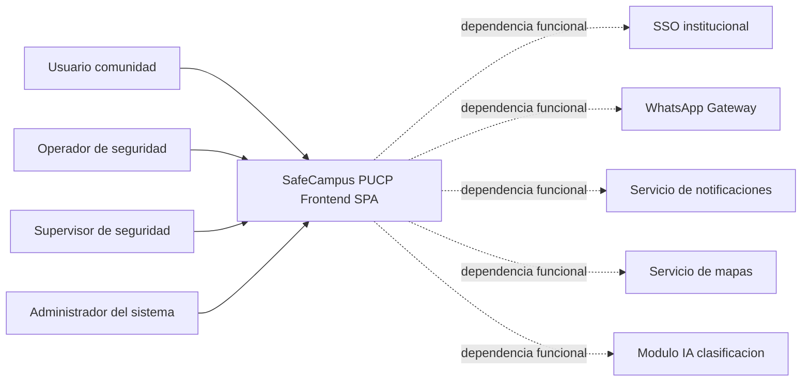
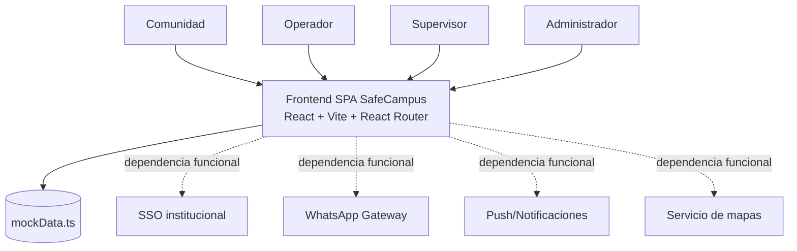
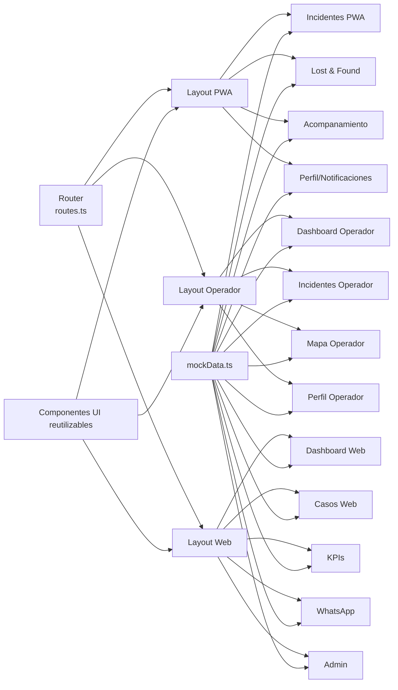
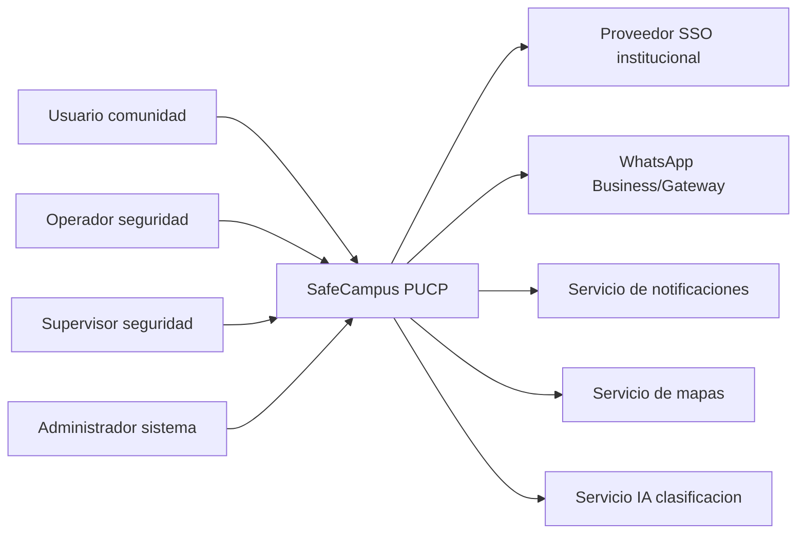
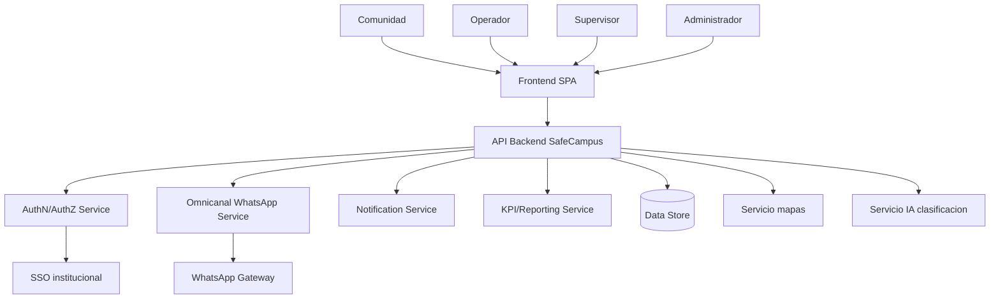
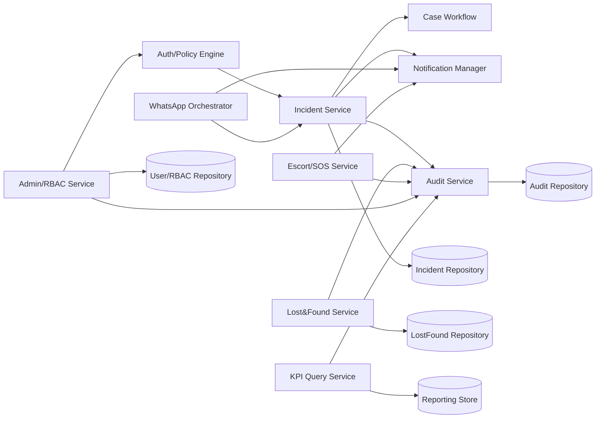
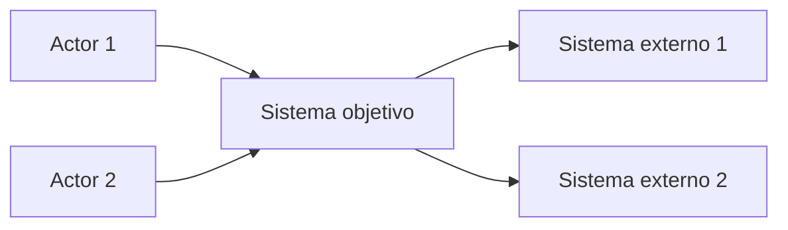
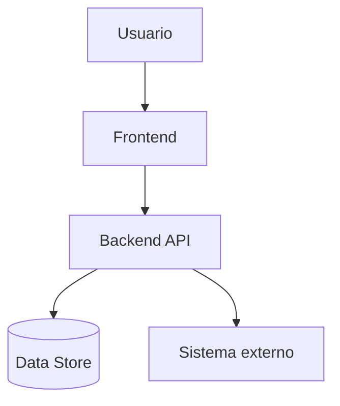
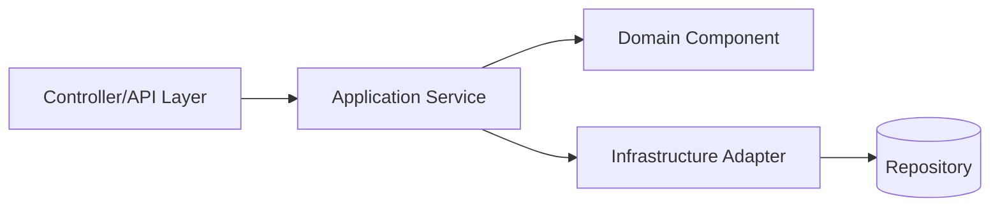

# README C4 - Base Tecnica de Arquitectura (SafeCampus PUCP)

## 1. Alcance y criterio de evidencia
Este documento levanta arquitectura con estrategia C4 a partir del frontend disponible en el repositorio.

Reglas aplicadas:
- As-Is: solo evidencia observable en codigo frontend.
- To-Be: propuesta arquitectonica necesaria para operar en produccion, marcada como propuesta.
- No se inventa backend implementado ni base de datos existente en el codigo actual.

Fuentes de evidencia principales:
- `src/app/routes.ts`
- `src/app/App.tsx`
- `src/main.tsx`
- `src/app/pages/pwa/*`
- `src/app/pages/operador/*`
- `src/app/pages/web/*`
- `src/app/data/mockData.ts`
- `src/imports/pasted_text/gestion-usuarios-seguridad.md`

---

## 2. Base tecnica solicitada (solo desde el codigo)

### 2.1 Modulos o dominios funcionales visibles en el frontend
1. Autenticacion y seleccion de rol.
2. PWA Comunidad.
3. Operacion movil de seguridad (operador).
4. Web operativa (supervision y gestion de casos).
5. Web analitica (KPIs y reportes).
6. Integracion operativa WhatsApp (gestion de conversaciones).
7. Administracion del sistema (usuarios, roles/permisos, integraciones, auditoria).
8. Lost & Found.
9. Acompanamiento seguro y SOS.
10. Notificaciones y perfil.

### 2.2 Pantallas o rutas principales
Ruteo central en `src/app/routes.ts`:
- `/` -> Login
- `/docs/components` -> Showcase de componentes
- `/pwa` (layout + subrutas)
  - `/pwa` (home)
  - `/pwa/reportar`
  - `/pwa/mis-casos`
  - `/pwa/lost-found`
  - `/pwa/acompanamiento`
  - `/pwa/perfil`
- `/operador` (layout + subrutas)
  - `/operador` (dashboard)
  - `/operador/incidentes`
  - `/operador/mapa`
  - `/operador/perfil`
- `/web` (layout + subrutas)
  - `/web` (dashboard)
  - `/web/casos`
  - `/web/kpis`
  - `/web/whatsapp`
  - `/web/admin`

### 2.3 Componentes compartidos/reutilizables mas importantes
1. Biblioteca UI reusable en `src/app/components/ui/*` (shadcn/radix wrappers).
2. `button.tsx`, `card.tsx`, `table.tsx`, `dialog.tsx`, `tabs.tsx`, `select.tsx`, `form.tsx`.
3. `chart.tsx` para visualizacion reutilizable.
4. `sidebar.tsx` y `navigation-menu.tsx` para patron de navegacion.
5. Utilidades en `src/app/components/ui/utils.ts`.
6. `src/app/components/figma/ImageWithFallback.tsx` como pieza utilitaria de presentacion.

Nota: existe reutilizacion de componentes UI base, pero la logica de negocio permanece en paginas.

### 2.4 Como esta organizada la navegacion
1. Router principal con `createBrowserRouter` en `src/app/routes.ts`.
2. Arquitectura por layouts: `PWALayout`, `OperadorLayout`, `WebLayout`.
3. Cada layout usa `Outlet` y controla navegacion interna (menu inferior en PWA/Operador, sidebar en Web).
4. Login selecciona rol y redirige por ruta (`navigate(path)`) en `Login.tsx`.
5. No se observan route guards reales con validacion de sesion/autorizacion backend.

### 2.5 Servicios externos o APIs que parece consumir
Observado en codigo:
- No hay llamadas HTTP reales (`fetch`, `axios`, `react-query`, `swr`, `apollo`) en el frontend actual.
- Datos alimentados por mocks locales en `src/app/data/mockData.ts`.

Dependencias externas inferibles por dominio funcional/documental (no consumidas via API en este codigo):
- SSO institucional.
- Gateway WhatsApp.
- Servicio de notificaciones.
- Servicio de mapas.
- Modulo IA de clasificacion.

### 2.6 Manejo de estado usado por el proyecto
1. Estado local por pantalla con `useState`.
2. Estado derivado local con filtros/listados sobre `mockData`.
3. `useEffect` para temporizadores y comportamiento UI (ejemplo: SOS/acompanamiento).
4. No hay store global (Redux/Zustand/MobX/Recoil) para estado de dominio.
5. Context API aparece en componentes UI base (no como estado global funcional del producto).

### 2.7 Mapeo C4 preliminar (UI, contenedores y componentes)
- Interfaces de usuario:
  - PWA Comunidad
  - App movil Operador (frontend en modo movil)
  - Web Supervisor/Admin
- Contenedores (As-Is):
  - Un solo contenedor desplegable: SPA React/Vite
- Componentes internos (As-Is, dentro del contenedor frontend):
  - Router y layouts
  - Modulo Incidentes
  - Modulo Dashboard/Mapa
  - Modulo KPIs
  - Modulo WhatsApp
  - Modulo Admin
  - Modulo Lost & Found
  - Modulo Acompanamiento
  - Capa de datos mock
  - Capa UI reusable

### 2.8 Supuestos o vacios no inferibles solo desde frontend
1. Politica real de autenticacion/autorizacion (tokens, sesiones, claims) -> no verificable.
2. Contratos API y seguridad de backend -> no verificable.
3. Persistencia, consistencia transaccional y auditoria persistente -> no verificable.
4. Integraciones tecnicas reales (SSO, WhatsApp, IA, notificaciones, mapas) -> no verificables en runtime.
5. Mecanismos de observabilidad, monitoreo, despliegue y tolerancia a fallos -> no verificables.
6. Modelo fisico de datos -> no verificable.

---

## 3. C4 As-Is

## 3.1 C1 As-Is (System Context)
### Descripcion
SafeCampus PUCP (frontend) interactua con actores de negocio por rol. Las integraciones externas aparecen como dependencias funcionales, no como consumo API real en el codigo actual.

### Diagrama Mermaid (C1 As-Is)

## 3.2 C2 As-Is (Containers)
### Contenedores identificados (implementados)
| Contenedor | Tecnologia | Responsabilidad | Evidencia |
|---|---|---|---|
| Frontend SPA SafeCampus | React + Vite + React Router | Renderizar todas las interfaces, navegacion por rol, logica UI local, visualizacion de datos mock | `src/main.tsx`, `src/app/App.tsx`, `src/app/routes.ts`, `src/app/pages/*` |

### Diagrama Mermaid (C2 As-Is)

## 3.3 C3 As-Is (Componentes internos del contenedor Frontend)
### Componentes internos principales
| Componente interno | Responsabilidad | Evidencia |
|---|---|---|
| Router principal | Definir rutas y arbol de navegacion | `src/app/routes.ts` |
| Layout PWA | Navegacion comunidad (bottom nav) | `src/app/pages/pwa/PWALayout.tsx` |
| Layout Operador | Navegacion operador movil | `src/app/pages/operador/OperadorLayout.tsx` |
| Layout Web | Sidebar/topbar para supervisor/admin | `src/app/pages/web/WebLayout.tsx` |
| Modulo Incidentes | Registro, consulta, gestion, cierre UI | `PWAReportar.tsx`, `PWAMisCasos.tsx`, `OperadorIncidentes.tsx`, `WebCasos.tsx` |
| Modulo Dashboard/Mapa | Visualizacion operativa georreferenciada | `OperadorDashboard.tsx`, `OperadorMapa.tsx`, `WebDashboard.tsx` |
| Modulo KPIs | Indicadores y exportacion UI | `WebKPIs.tsx` |
| Modulo WhatsApp | Gestion conversacional omnicanal UI | `WebWhatsApp.tsx` |
| Modulo Admin | Usuarios, roles, integraciones, auditoria UI | `WebAdmin.tsx` |
| Modulo Lost & Found | Registro y consulta de objetos | `PWALostFound.tsx` |
| Modulo Acompanamiento | Trayecto seguro, temporizador, SOS | `PWAAcompanamiento.tsx` |
| Capa datos mock | Entidades y datasets de demo | `src/app/data/mockData.ts` |
| Biblioteca UI | Controles base reutilizables | `src/app/components/ui/*` |

### Diagrama Mermaid (C3 As-Is)

---

## 4. C4 To-Be (Propuesto)

## 4.1 C1 To-Be (System Context propuesto)
### Objetivo
Completar el sistema con servicios backend y autorizacion real por rol/accion para pasar de demo frontend a plataforma operativa.

### Diagrama Mermaid (C1 To-Be)

## 4.2 C2 To-Be (Containers propuestos)
### Contenedores propuestos
| Contenedor | Estado | Responsabilidad |
|---|---|---|
| Frontend SPA | As-Is | UI omnicanal, navegacion por rol, consumo API |
| API Backend SafeCampus | Propuesto | Casos de uso, validaciones, RBAC, auditoria, integraciones |
| Servicio de autenticacion/autorizacion | Propuesto | Sesiones, tokens, claims, evaluacion RBAC |
| Servicio de mensajeria omnicanal | Propuesto | Orquestacion WhatsApp/bot/handoff humano |
| Servicio de notificaciones | Propuesto | Push/in-app/eventos de incidente |
| Almacen de datos operacional | Propuesto | Persistencia de incidentes, usuarios, auditoria, lost&found |
| Motor analitico/KPI | Propuesto | Agregaciones para indicadores y reportes |

### Diagrama Mermaid (C2 To-Be)

## 4.3 C3 To-Be (Componentes internos propuestos)
### Componentes propuestos del backend (para completar C3)
| Componente backend propuesto | Función |
|---|---|
| Auth Controller/Policy Engine | Validar identidad y permisos RBAC por modulo/accion |
| Incident Application Service | Orquestar ciclo de vida de incidentes |
| Case Workflow Component | Reglas de asignacion, escalamiento, cierre y SLA |
| WhatsApp Orchestrator | Bot + takeover + reasignacion + cierre conversacion |
| Notification Manager | Eventos y envio multicanal |
| Lost&Found Service | Registro, busqueda y cierre de casos de objetos |
| Escort/SOS Service | Gestion de trayectos y alertas de acompanamiento |
| Admin/RBAC Service | Usuarios, roles, permisos y matriz efectiva |
| Audit Service | Registro inmutable de acciones criticas |
| KPI Query Service | Proyecciones para dashboards y reportes exportables |

### Diagrama Mermaid (C3 To-Be, vista API Backend)

---

## 5. Plantillas C4 en Mermaid (reutilizables)

## 5.1 Plantilla C1 (Context)

## 5.2 Plantilla C2 (Containers)

## 5.3 Plantilla C3 (Components)

---

## 6. Trazabilidad rapida para construir diagramas

## 6.1 Trazabilidad As-Is (codigo -> C4)
| Evidencia en codigo | Nivel C4 sugerido |
|---|---|
| `src/app/routes.ts` | C2/C3 (frontera de navegacion y modulos) |
| `src/app/pages/pwa/*` | C3 (componentes funcionales PWA) |
| `src/app/pages/operador/*` | C3 (componentes funcionales operador) |
| `src/app/pages/web/*` | C3 (componentes funcionales web) |
| `src/app/data/mockData.ts` | C2/C3 (origen de datos en As-Is) |
| `src/app/components/ui/*` | C3 (biblioteca UI compartida) |

## 6.2 Reglas de modelado recomendadas
1. No dibujar base de datos en As-Is como contenedor implementado (solo mock local).
2. Dibujar dependencias externas en As-Is como "dependencia funcional".
3. Dibujar backend/data store solo en To-Be y marcarlo como propuesto.
4. Mantener consistencia de nombres entre RBAC, modulos y diagramas C4.

---

## 7. Vacios y limitaciones (obligatorio para uso academico)
1. No hay consumo API real en el frontend actual.
2. No hay backend implementado en el repositorio.
3. No hay persistencia real verificada.
4. No hay enforcement verificable de RBAC en runtime.
5. El To-Be requiere validacion con ERS/BPMN y asesoria de tesis antes de considerarse definitivo.
